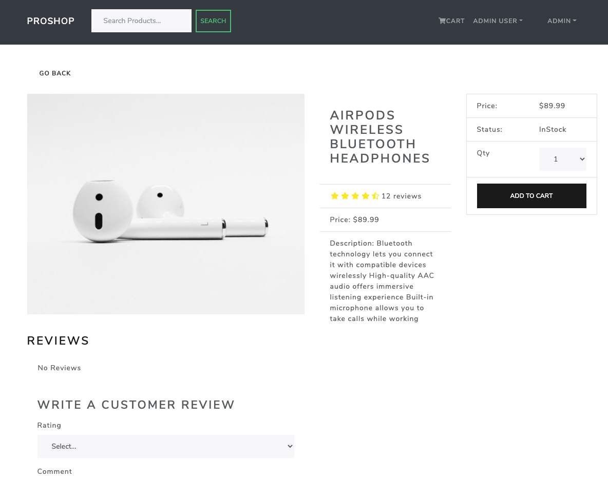
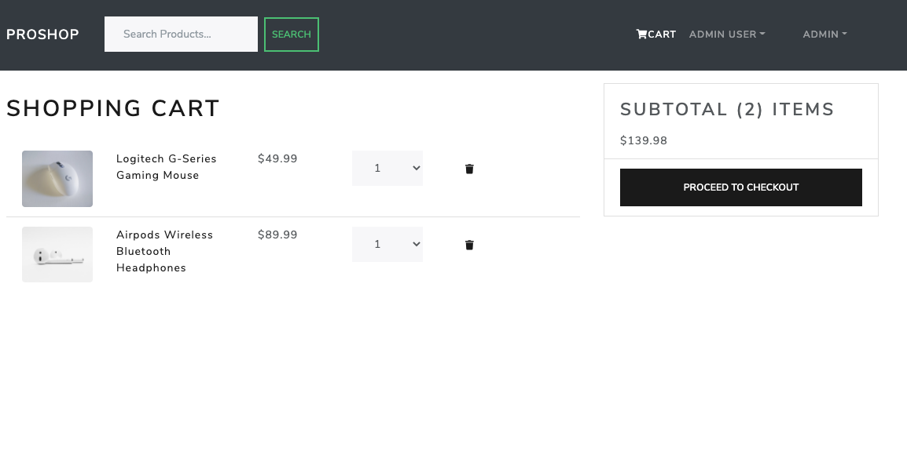
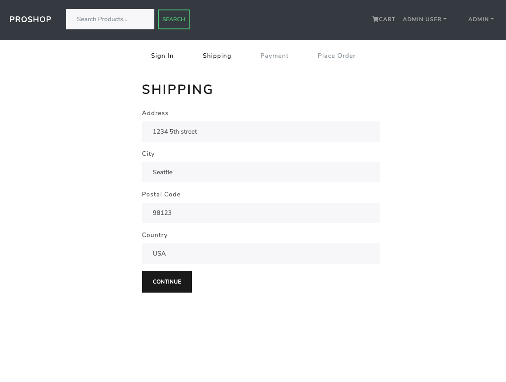
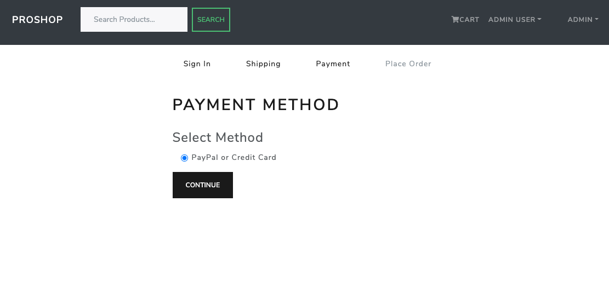
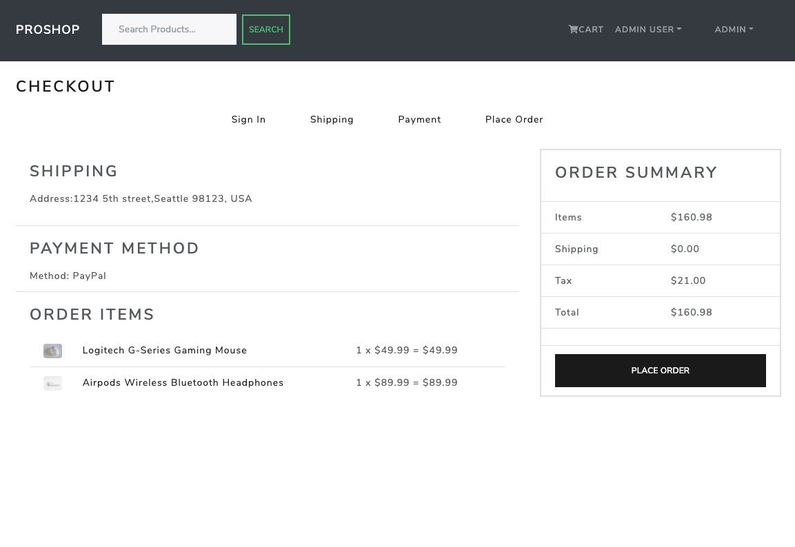
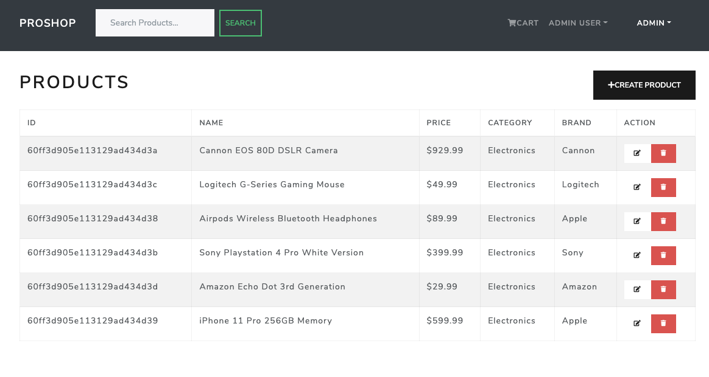

# MERN-Proshop

## Description

A full stack project using the MERN stack to sell products.

## Table of Contents

- [Usage](#usage)
- [App Structure](#app-structure)
- [Media](#Media)
- [Languages](#languages)
- [Deployed](#Deployed)
- [Questions](#questions)
- [Contributers](#contributers)

## Usage

Pro shop is a full stack MERN site for eCommerce. A seller or Admin user can create and display products. Orders can be taken and payments processed by PayPal. Orders can be updated and maked as paid and shipped.

Users can create profiles to save their info.

This project is based off a Udemy course from Brad Traversy.

## App-Structure

App-Structure

## Media

## Languages

JavaScript, ReactJS, MongoDB, CSS, HTML, Express, Node.JS, bycryptjs, jsonwebtokens, Axios, Multer, Mongoose, Morgan

## Deployed

Deployed on Heroku

- https://proshopapppl.herokuapp.com/

## Repository

- https://github.com/PeteLow-13/Proshop

## Questions

Contact me via email or github with questions

## Contributers

- Pete Low:
- [PeteLow-13](http://github.com/PeteLow-13)
- pedritolow@gmail.com
